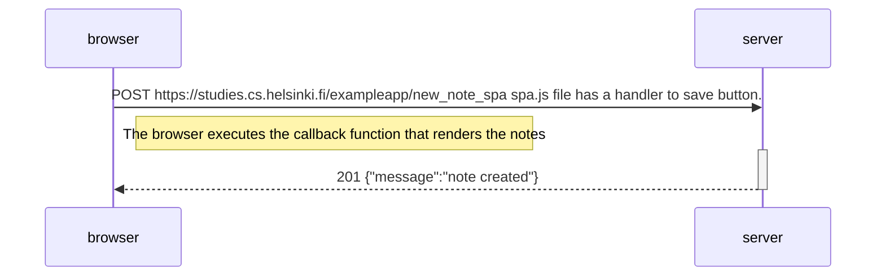

```mermaid
sequenceDiagram
    participant browser
    participant server

     browser->>server: POST https://studies.cs.helsinki.fi/exampleapp/new_note_spa spa.js file has a handler to save button.
     Note right of browser: The browser executes the callback function that renders the notes
    activate server
    server-->>browser: 201 {"message":"note created"}
    deactivate server

```
